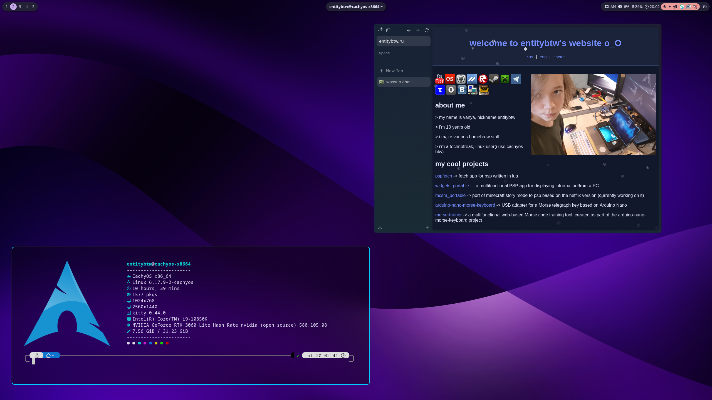

# dotfiles

### [english readme version / английская версия readme](./README.md)

Hyprland дотфайлы моего основного ПК [CachyOS]



## Установка

**Внимание:**
если у вас уже есть папки с такими же именами, как в этом репозитории, внутри `~/.config/` (например, `rofi`, `waybar`, `kitty`), они **будут перезаписаны** во время установки.
обязательно заранее сделайте бэкап этих конфигураций вручную, чтобы не потерять данные.

1. Клонируйте репозиторий:

```
git clone https://github.com/entitybtw/dotfiles.git
```

2. Скопируйте содержимое папки `.config` в ваш локальный каталог `.config`:

```
cp -r dotfiles/.config/* ~/.config/
```

3. Удалите папку с клонированным репозиторием:

```
rm -rf dotfiles
```

4. Перезапустите сессию или нужные приложения, чтобы применить новые конфигурации.
